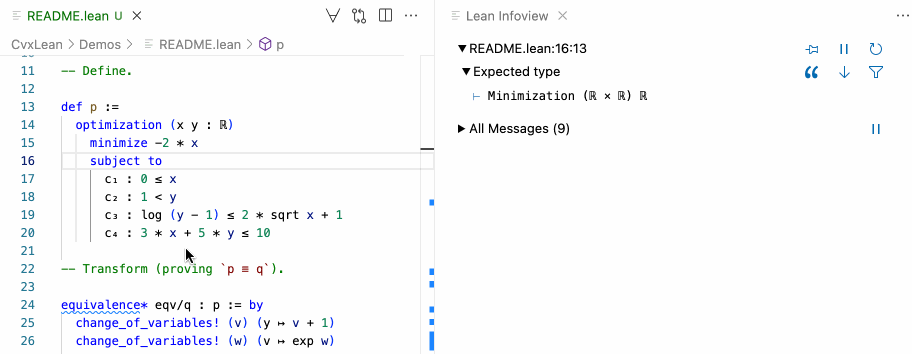

# CvxLean<!-- omit in toc -->

CvxLean is a convex optimization modeling framework written in [Lean 4](https://leanprover.github.io/lean4/doc/).

Problems are stated using definitions from [mathlib](https://github.com/leanprover-community/mathlib) and can be rigorously transformed both automatically and interactively. They can be solved by calling the backend solver [MOSEK](https://www.mosek.com/).

Summary of features:
* **Formal definitions**. Users can define [optimization problems](https://verified-optimization.github.io/CvxLean/CvxLean/Lib/Minimization.html) in a natural way using custom syntax. These are formal objects we can reason about; usually, we want to talk about [equivalences](https://verified-optimization.github.io/CvxLean/CvxLean/Lib/Equivalence.html), [reductions](https://verified-optimization.github.io/CvxLean/CvxLean/Lib/Reduction.html), and [relaxations](https://verified-optimization.github.io/CvxLean/CvxLean/Lib/Relaxation.html). 
* **User-guided transformations**. For each relation (equivalence, reduction, and relaxation), we have formalized several relation-preserving transformations. These are realized as tactics and can be applied interactively in the `equivalence`, `reduction`, or `relaxation` commands.
* **Proof-producing DCP transformation**. Our main contribution is a verified version of the [disciplined convex programming (DCP)](https://web.stanford.edu/~boyd/papers/disc_cvx_prog.html) canonization algorithm. It can be used through the `dcp` tactic. The `solve` command also uses it behind the scenes.
* **Automatic transformation into DCP form**. The `pre_dcp` tactic uses [egg](https://github.com/egraphs-good/egg) to find a sequence of rewrites to turn a problem into an equivalent DCP-compliant problem.

Auto-generated documentation can be found [here](https://verified-optimization.github.io/CvxLean/).

#### Contents
- [Installation](#installation)
- [Usage](#usage)
  - [Defining problems](#defining-problems)
  - [Solving problems](#solving-problems)
  - [Transforming problems](#transforming-problems)
    - [Commands for user-guided transformations](#commands-for-user-guided-transformations)
    - [Equivalence-preserving tactics](#equivalence-preserving-tactics)
- [Quick demo](#quick-demo)
- [Citing](#citing)
- [Contributing](#contributing)

## Installation

You will need to install Lean, Rust and MOSEK following these steps:
1. Set up Lean 4 (see [these instructions](https://leanprover.github.io/lean4/doc/setup.html)), using the version from `lean-toolchain`. 
    * The easiest way is to use the `elan` version manager. 
    * If you're using VSCode, install the [Lean 4 extension](https://marketplace.visualstudio.com/items?itemName=leanprover.lean4).
2. Install Rust (see [these instructions](https://www.rust-lang.org/tools/install)). This step is only necessary to enable the `pre_dcp` tactic.
3. Download [MOSEK 10.0.12(BETA)](https://www.mosek.com/downloads/10.0.12/).
    * Make sure that the directory containing the `mosek` binary is in your `$PATH`. 
    * To avoid any issues with this, we recommend also adding it to `CvxLean/Command/Solve/Mosek/Path.lean`. 
    * Obtain a [MOSEK license](https://www.mosek.com/license/request/?i=trl) and place it in your home directory, i.e. `$HOME/mosek/mosek.lic`.

Finally, go into the top `CvxLean` directory and run:

```
./build.sh
```

## Usage

One of the best ways to get started is to take a look at the examples in `CvxLean/Test` and `CvxLean/Examples`. We provide a short guide here.

### Defining problems

Consider the optimization problem:

$$
\begin{align*}
\textrm{maximize}   &&& \sqrt{x - y} \\
\textrm{subject to} &&& y = 2 x - 3, \\
                    &&& x ^ 2 \le 2.
\end{align*}
$$

In CvxLean, it is defined as follows (see `Test/Solve/Problems/SO.lean`):

```lean
def p :=
  optimization (x y : ℝ)
    maximize sqrt (x - y)
    subject to
      c₁ : y = 2 * x - 3
      c₂ : x ^ 2 ≤ 2
      c₃ : 0 ≤ x - y
```
This is a term of type `Minimization (ℝ × ℝ) ℝ`. Our syntax allows us to use variable names and also name constraints, which is useful for referring to them.

An important remark is that we require the condition `0 ≤ x - y`, which is usually omitted, as `CvxLean` will need to know that the square root application in the objective function is well-defined to produce a proof of equivalence between `p` and its conic form counterpart.

### Solving problems

Once `p` has been defined, we can ask CvxLean to solve it as follows.

```lean
solve p 
```

This command canonizes `p` and calls MOSEK.

If successful, it will add several definitions to the environment:
* `p.conicForm`: the conic form of the problem after applying the DCP canonization procedure.
* `p.status`: the feasibility status of the primal and the dual problem, in this case `"PRIMAL_AND_DUAL_FEASIBLE"`, i.e. optimal.
* `p.value`: if the problem is optimal, it corresponds to the (approximate) optimal value.
* `p.solution`: if the problem is optimal, it corresponds to the (approximate) optimal point.

Crucially, we formally verify that `p` is equivalent to `p.conicFrom`.

In this case, `p.solution` is $(-1.414214, -5.828427)$.

### Transforming problems

Problems can also be transformed interactively. We will show the commands and tactics that we provide for this purpose.

#### Commands for user-guided transformations

To motivate the need for this, we start with a simple example.
Suppose our problem has $\exp(x)\exp(y)$ in one of the constraints, which is not a DCP-compliant expression. 
We can replace the expression with $\exp(x+y)$ as follows:
```lean
equivalence eqv/q :
  optimization (x y : ℝ)
    maximize x + y
    subject to
      h : (exp x) * (exp y) ≤ 10 := by
  conv_constr => 
    rw [← exp_add]

#print q
-- def q : Minimization (ℝ × ℝ) ℝ :=
-- optimization (x : ℝ) (y : ℝ) 
--   maximize x + y
--   subject to
--     h : exp (x + y) ≤ 10
```
The transformation is done in a verified way using the lemma `exp_add` [from mathlib](https://github.com/leanprover-community/mathlib4/blob/master/Mathlib/Data/Complex/Exponential.lean#L176), which says that $\exp(x+y) = \exp(x) \exp(y)$. CvxLean generates a proof of equivalence (`eqv`) between the initial problem and `q`.

There are three commands for user-guided transformations, each enforcing a different proof term to be generated. They all have the form `command pf/q : p`, where `p` is the initial problem, `q` is the resulting problem and `pf` is the correctness proof. A sequence of tactics in these commands generates `q` and `pf`.
* `equivalence`: the goal is to show `p ≡ q`. Mathematically, if $P$ is a problem over $D$ and $Q$ is a problem over $E$, equivalence is witnessed by a pair of functions $\varphi : D \to E$ and $\psi : E \to D$ such that $\varphi$ maps solutions of $P$ to solutions of $Q$ and $\psi$ maps solutions of $Q$ to solutions of $P$.
* `reduction`: the goal is to show `p ≼ q`. In this case, only a solution-preserving $\psi : E \to D$ is required.
* `relaxation`: the goal is to show `p ≽' q`. Here, only a feasibility-preserving $\varphi : D \to E$ is required, with the additional requirement that $g(\varphi(x)) ≤ f(x)$ for all $P$-feasible $x$, where $f$ and $g$ are the objective functions of $P$ and $Q$, respectively.

A small implementation detail is that the goal is actually set up with a metavariable, e.g. `⊢ p ≡ ?q`. The user transforms the left-hand side and the final state is closed by reflexivity, which instantiates `?q` with the problem shown in the last step.

Users rarely build $\varphi$ or $\psi$ directly. Instead, we have tactics to do that for us, which we will show next.

#### Equivalence-preserving tactics 

The commands set the environment for verified transformations, but what tactics should one use? We have several specialized equivalence-preserving tactics (e.g., `conv_constr` above), which we explain here. We split them into two groups.

Fully automated: 
* `dcp` transforms a problem into conic form.
* `pre_dcp` transforms a problem into DCP form.

User-directed:
* `conv_constr h => ...` and `conv_obj => ...` are used to travel to one of the components of the problem in order to rewrite or simplify it (they are special cases of Lean's [conv](https://lean-lang.org/theorem_proving_in_lean4/conv.html)).
* `rw_constr h => ...` and `rw_obj => ...` are used similarly to the previous ones but used for conditional rewrites. Sometimes rewrites are only valid withing the feasible set of the problem, these tactics will assume the appropriate constraints.
* `change_of_variables (u) (x ↦ ...)`, where `u : ℝ` is a new variable and `x : ℝ` is an optimization variable (we currently only support real variables). It performs a change of variables, using a pre-defined library of valid changes, and proves any side conditions that arise.
* `remove_constr h => ...` requires a proof that the constraint `h` is implied from the other constraints, in which case it can be removed. 
* `rename_constrs [h₁, h₂, ...]` and `rename_vars [x₁, x₂, ...]` are used to give new names to constraints and variables, respectively. They are useful for visualization purposes. Similarly, `reorder_constrs [h₁, h₂, ...]` will reorder the constraints given a permutation of the constraint names.
* Any lemma that proves an equivalence can be used as a tactic. To achieve the desired effect, it must be used in combination with `equivalence_step => ...`. For example, `map_objFun_log` states that applying $\log$ to the objective function yields an equivalence (if the objective function is positive in the feasible set). One can write `equivalence_step => apply map_objFun_log (...)`. In the future, all these transformations will be wrapped as tactics.

## Quick demo 

We show how to rigorously transform and solve the following problem in CvxLean:

$$
\begin{align*}
\textrm{minimize}   &&& -2x \\
\textrm{subject to} &&& 0 \leq x, \\
                    &&& 1 < y, \\
                    &&& \log(y - 1) ≤ 2\sqrt{x} + 1, \\
                    &&& 3x + 5y ≤ 10. \\
\end{align*}
$$

Note that the solution is $\approx (5/3, 1)$.



You can find this example in `CvxLean/Demos/README.lean`.

## Citing

```
@inproceedings{bentkamp2023verified,
  title={Verified reductions for optimization},
  author={Bentkamp, Alexander and Fern{\'a}ndez Mir, Ramon and Avigad, Jeremy},
  booktitle={International Conference on Tools and Algorithms for the Construction and Analysis of Systems},
  pages={74--92},
  year={2023},
  organization={Springer}
}
```

## Contributing 

There are many opportunities to improve CvxLean and many features that we would like to see implemented, so we welcome any contributions!

Some things to keep in mind when opening a pull request:
* Follow [Lean's commit convention](https://lean-lang.org/lean4/doc/dev/commit_convention.html).
* Follow [mathlib's style guidelines](https://leanprover-community.github.io/contribute/style.html) (style is actually checked in CI).
